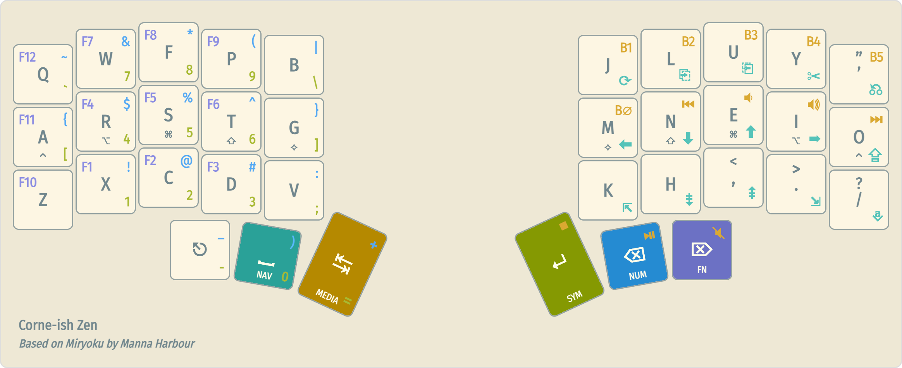

# Corne-ish Zen V2 Custom Configuration

You are viewing a fork of the [official configuration repo](https://github.com/LOWPROKB/zmk-config-Zen-2). The Corne-ish Zen uses ZMK firmware.

This repo implements the keyboard layout below. It is my streamlined version of the [miryoku layout](https://github.com/manna-harbour/miryoku).

