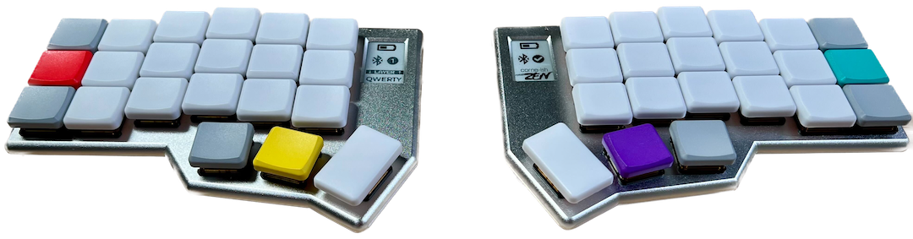

# 👊 Knucklehead

A keyboard layout for knuckleheads.

> [!WARNING]\
> Under ***active development***, use at your own risk.

Knucklehead is a mnemonic, macOS-optimized, 42-key[^1] ergo/columnar keyboard layout, designed to ease the transition to this style of board for those coming from traditional Apple keyboards.




> Drawn with [Keymap Drawer](https://github.com/caksoylar/keymap-drawer)

## Features

> [!NOTE]\
> I use Colemak-DH, but it should work identically with QWERTY.

- Minimal and intuitive layer switching
- Keys are repositioned in clusters to either "familiar" relative positions, or otherwise logical ones, e.g.
  - `[{` `]}` `\|` `-_` `=+` keys retain their order/position relative to each other, but are moved as a cluster to vertical combos more easily accessible to stronger fingers.
  - `;:` is accessible as a combo on a stronger finger, but retains its own relative position to the `'"` key.
  - `1–5` numbers retain their familiar "left, upper-row" position on `Layer 2`; `6–0` are moved to the left hand, though, right below `1–5`. This not only feels natural for single handed numeric typing, but also moves the most used symbols [for programming] to more accessible positions.
  - Speaking of symbols, they're duplicated as combos on `Layer 1` in almost exactly the same position as their corresponding numbers on `Layer 2`, so if you already associate symbol positions with numbers you don't have to relearn them nor force disassociation.
  - Now logical operator symbols `&` and `|` are on the same finger/position, opposite hands.
  - Also now `\` and `/` are next to each other.
  - `Control`, `Option` and `Command` also keep their relative positions but are moved to "mod-tap" keys on `Layer 1`, and on the same position but as "sticky keys" on `Layer 2`. This allows for easy 2 handed or 1 handed shortcuts.
  - Arrow keys are moved to `Layer 2` onto the traditional VIM position.
  - `Tab` and ``` `~ ``` are moved to inner thumbs on each hand, where their proximity to the `Command` key makes typical App/Window switching a more comfortable, symmetrical "pinch" 🤏 motion.
  - `Fn` key is moved to the right bottom corner, and it activates the `Fn` layer, which has all `F` keys organized in the same position as their corresponding numbers on `Layer 2` (plus 2 extra ones which go where you imagine they would).
  - Bluetooth profile selectors can also be found on the `Fn` layer, as combos aligned with their corresponding numeric positions.
  - Media keys retain almost their relative position, except they're re-arranged a bit so:
    - `volume up / down` align with `+ / -` and `Up / Down` arrows, and `U` ("up") and `L` ("low") keys.
    - `back / forward` align with `Left / Right` arrows.
- Other mnemonics:
  - `C`: `Command`
  - `Comma`: `Command`
  - `Control` aligns with the `^` symbol, and the `A` (which also kinda looks like a caret, amirite?)
  - `X`: `Option` — alright, I'm reaching, but its symbol kinda looks like an "x"? If you squint? No?
    - And doesn't the `&` also kinda have a tiny `x` on its bottom-right? 'cause it's also aligned here
  - `S`: `*` ("star")
  - `R`: `&` which, again, kinda similar, no?
  - `I`: `|`, same finger/position as `&` but on the opposite hand
  - `Tab` is next to `Space`
  - `H`: `{` ("hash table" or "hash map")
  - `N`: `-` ("negative")
  - `L`: `-` and `_` ("low")
  - `E`: `=` ("equals")
  - `U`: `+` ("up")
  - `P`: `$` ("peso")
  - `~`, a reference to the "home" directory on 'nix systems is near the `H`
- A 4th `Meh` modifier is added to the cluster which corresponds to pressing `Control`, `Option` and `Shift` but with a single key, instead of 3. This makes complex shortcuts significantly more comfortable (works great for window managers, app launchers, etc.).

## F.A.Q.s

#### Why "Knucklehead"?

While searching for mnemonic-related names I saw the primary image on the [Wikipedia article for "mnemonic"](https://en.wikipedia.org/wiki/Mnemonic) (a representation of the [Knuckle mnemonic](https://en.wikipedia.org/wiki/Knuckle_mnemonic)), and it occurred to me it'd be a relevant and ***funny*** name (like a slightly more rude version of "a layout for dummies").

#### Why no "home row mods"?

A few reasons:

- I wanted to keep them in the same position across layers without dictating the position of nor interfering with other typically held keys (e.g. arrows).
- I wanted to diminish their interference with normal/fast typing without over-complicating their implementation, timing configuration, etc. Putting them on "less used" keys helps.
- Decades of muscle memory for I don't know how many shortcuts across who knows how many apps had me unconsciously reaching for those positions anyway.
- I feel like the deliberate, paused, "non-rolly" way I tend to use mods makes home position unnecessary.
- While they don't eliminate hand movement like HMRs, on this new position they still greatly minimize movement/effort, improve comfort when compared to their traditional Apple keyboard position, with the added benefit of leveraging some of your muscle memory.

## Resources

- [Darryl's amazing Corne-ish Zen](https://lowprokb.ca/collections/keyboards/products/corne-ish-zen)
- [ZMK Firmware GitHub](https://github.com/zmkfirmware/zmk)
- [ZMK Documentation](https://zmk.dev/docs)
- [ZMK Discord Server](https://zmk.dev/community/discord/invite)
- [@caksoylar's Keymap Drawer](https://github.com/caksoylar/keymap-drawer), [ZMK config](https://github.com/caksoylar/zmk-config) and [Display improvements for Corne-ish Zen](https://gist.github.com/caksoylar/c411313990978e1903c244f03039187a)
- [@urob's ZMK config](https://github.com/urob/zmk-config/tree/main#user-content-fnref-2-d3679a99d5e7e01f223977affdb47938)
- ["Callum-style Mods"](https://github.com/qmk/qmk_firmware/blob/master/users/callum/readme.md)
- [Colemak-DH](https://colemakmods.github.io/mod-dh/) and the [Effort Grid](https://colemakmods.github.io/mod-dh/model.html)

## Instructions

1. Edit the keymap file(s):
    - Change [the keymap file](/config/corneish_zen.keymap) to edit keycodes, add new layers etc.
    - Change [the conf file](/config/corneish_zen.conf) to edit configuration settings like changing the deep sleep timeout
2. Commit and push. GitHub Actions will start building a new version of the firmware with the updated keymap and drawing.

## Firmware Files

To locate your firmware files...

1. Click "Actions" in the main navigation, and in the left navigation click the "Build" link.
2. Select the desired workflow run in the centre area of the page (based on date and time of the build you wish to use). You can also start a new build from this page by clicking the "Run workflow" button.
3. After clicking the desired workflow run, you should be presented with a section at the bottom of the page called "Artifacts". This section contains the results of your build, in a file called "firmware.zip"
4. Download the firmware zip archive and extract the two `.uf2` files. They are named according to which side they need to be flashed to.
5. Flash the firmware to your keyboard by double-clicking the reset button to put the it in bootloader mode. A window should pop up showing the contents of the storage on the keyboard. Drag and drop the correct `.uf2` file into the window. When the upload is complete the window will close and the keyboard will exit bootloader mode.
    - If you only changed [the keymap file](/config/corneish_zen.keymap) you only need to flash the left side firmware to the left side.
    - If you changed [the conf file](/config/corneish_zen.conf) you should flash both sides their respective files.

Your keyboard is now ready to use.

[^1]: Currently 42 keys because that's what I have/use, but honestly sometimes I feels like I have a few keys I don't know what to do with; though I often go back to re-adding them when I try removing them, so :shrug:.
